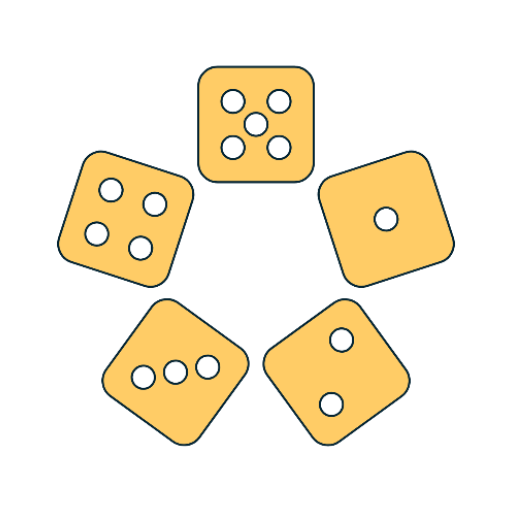
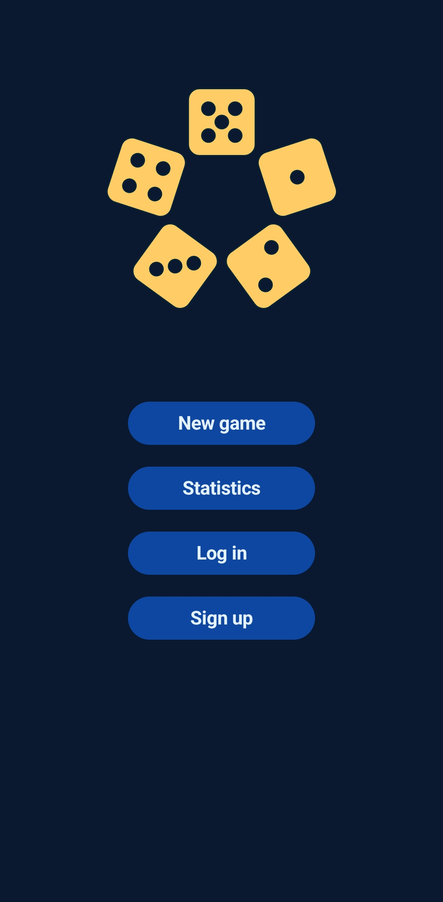
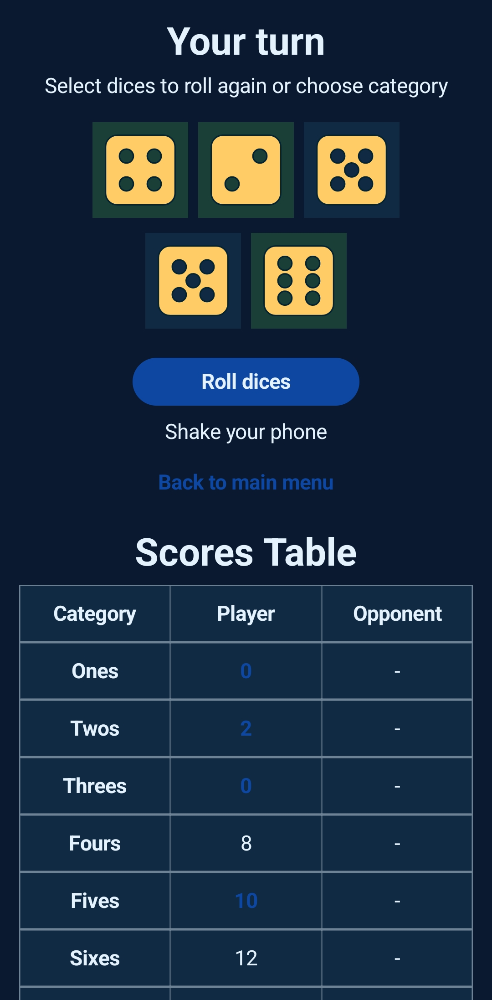
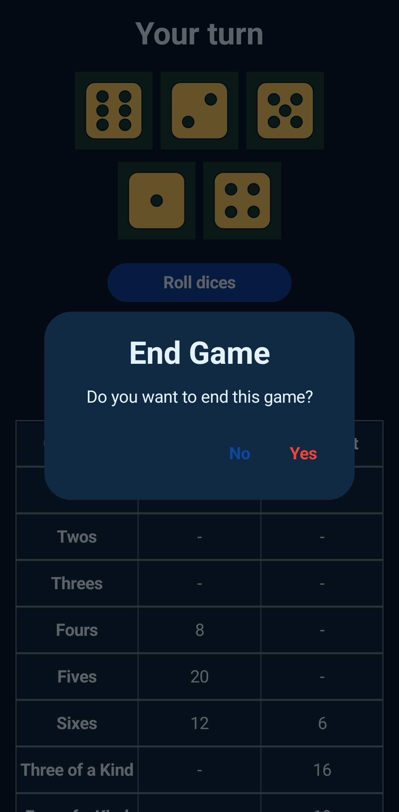
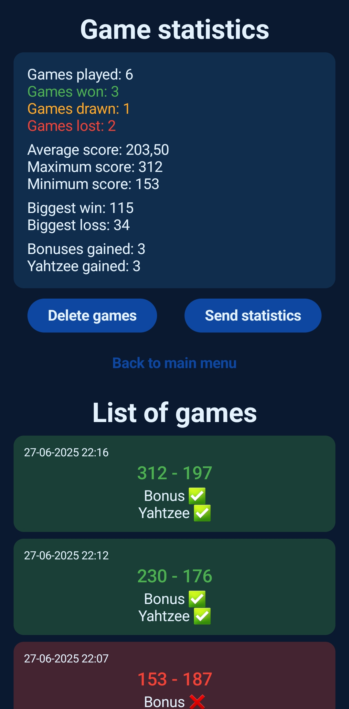
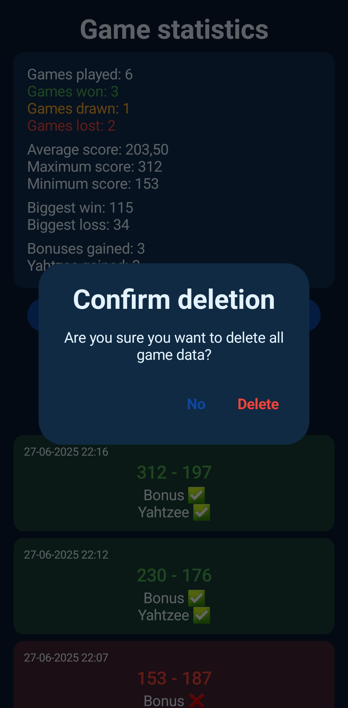
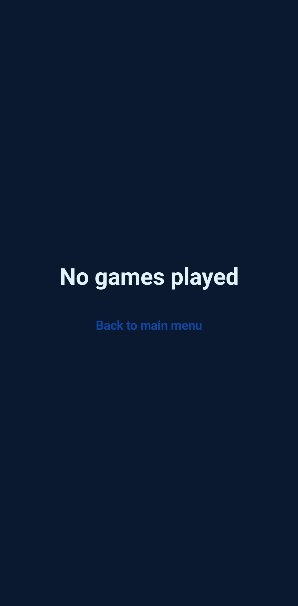
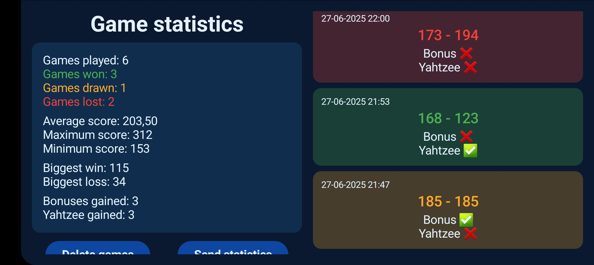

# 🎲 Yahtzee

## ℹ️ O projekcie

#### [🇬🇧 English version](#ℹ️-about-the-project)

Aplikacja powstała na przedmiocie `Aplikacje mobilne`, na VI semestrze studiów pierwszego stopnia na kierunku Informatyka na Politechnice Poznańskiej.

### ✅ Główne cechy aplikacji

* Jednoosobowa gra w kości z zaimplementowanym naiwnym przeciwnikiem
* Rejestracja użytkownika i logowanie
* Zapis wyników do bazy danych:
  * lokalnej, gdy gracz nie jest zalogowany
  * zdalnej, gdy gracz się zaloguje
* Możliwość zresetowania wyników oraz przesłania ich SMSem
* W trakcie rozgrywki można zobaczyć, ile punktów otrzyma gracz za każdą niewybraną jeszcze kategorię (automatyczne obliczenia po każdym rzucie)
* **Rzut koścmi realizowany jest przez potrząśnięcie telefonem**
* Obsługa obracania ekranu oraz dwa motywy

### 🛠️ Użyte narzędzia, języki i technologie

* Android Studio
* Kotlin
* Jetpack Compose
* Room DB
* Firebase Authentication
* Firebase Database

### 🚀 Uruchomienie aplikacji

1. Sklonuj repozytorium
2. Otwórz w Android Studio
3. Zamień [google_services.json](app/google-services.json) na własny plik, który wygenerujesz w konsoli Firebase
4. W pliku [strings.xml](app/src/main/res/values/strings.xml) dodaj własny `default_web_client_id`
5. Uruchom aplikację na emulatorze lub własnym urządzeniu

### [📷 Galeria](#gallery)

## ℹ️ About the project

#### [🇵🇱 Wersja polska](#ℹ️-o-projekcie)

The application was created for the `Mobile applications` course during the 6th semester of the Bachelor's degree in Computer Science at Poznan University of Technology.

### ✅ Main features of the application

* Single-player dice game with a basic AI opponent
* User registration and login
* Saving scores to a database:
  * local, when the player is not logged in
  * remote, when the player is logged in
* Option to reset scores and send them via SMS
* During gameplay, the user can see how many points they would get for each unchosen category (automatic calculations after every roll)
* **Rolling the dice is done by shaking the phone**
* Screen rotation support and two UI themes

### 🛠️ Tools, languages, and technologies used

* Android Studio
* Kotlin
* Jetpack Compose
* Room DB
* Firebase Authentication
* Firebase Database

### 🚀 Launching the application

1. Clone the repository
2. Open it in Android Studio
3. Replace [google_services.json](app/google-services.json) with your own file generated in the Firebase console
4. In the [strings.xml](app/src/main/res/values/strings.xml) file, add your own `default_web_client_id`
5. Run the application on an emulator or your own device

### 📷 Gallery

<table align="center" style="border-collapse: separate; border-spacing: 20px 10px; margin: auto;">
  <tr>
    <td></td>
    <td></td>
    <td></td>
  </tr>
  <tr>
    <td colspan="3" style="text-align: center;">
      
    </td>
  </tr>
  <tr>
    <td></td>
    <td></td>
    <td></td>
  </tr>
  <tr>
    <td colspan="3" style="text-align: center;">
      
    </td>
  </tr>
</table>
